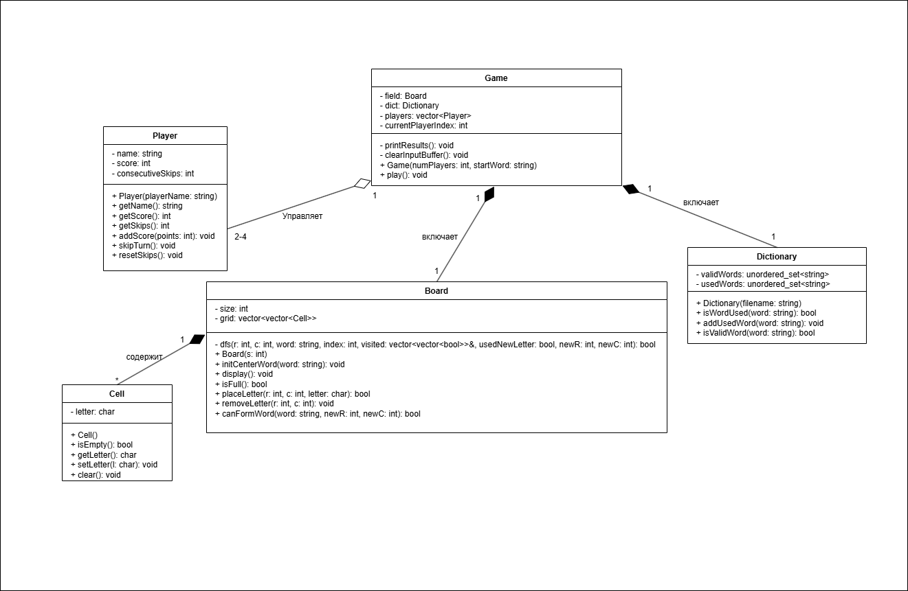

# Архитектура проекта

## Класс `Cell` (Клетка)

**Суть:**  
Атомарный элемент игрового поля, отвечающий за хранение одного символа.

### Свойства

- `letter: char` — символ, хранящийся в клетке.

### Методы

- `Cell()` — конструктор клетки.
- `isEmpty()` — проверяет, пуста ли клетка.
- `getLetter()` — возвращает символ, содержащийся в клетке.
- `setLetter(char)` — устанавливает символ в клетку.
- `clear()` — очищает клетку.

---

## Класс `Player` (Игрок)

**Суть:**  
Хранилище информации об игроке и его прогрессе в процессе игры.

### Свойства

- `name: string` — имя игрока.
- `score: int` — количество набранных очков.
- `consecutiveSkips: int` — количество пропусков хода подряд.

### Методы

- `Player(const string& playerName)` — конструктор игрока.
- `getName()` — возвращает имя игрока.
- `getScore()` — возвращает текущее количество очков.
- `getSkips()` — возвращает число последовательных пропусков.
- `addScore(int points)` — добавляет очки игроку.
- `skipTurn()` — увеличивает счётчик пропусков.
- `resetSkips()` — сбрасывает счётчик пропусков.

---

## Класс `Dictionary` (Словарь)

**Суть:**  
Обеспечивает лексическую корректность игры через хранение и проверку слов.

### Свойства

- `validWords: unordered_set<string>` — множество допустимых слов, загружаемых из файла.
- `usedWords: unordered_set<string>` — множество уже использованных слов.

### Методы

- `Dictionary(const string& filename)` — загружает словарь из файла.
- `isValidWord(const string& word)` — проверяет наличие слова в словаре.
- `isWordUsed(const string& word)` — проверяет, использовалось ли слово ранее.
- `addUsedWord(const string& word)` — добавляет слово в список использованных.

---

## Класс `Board` (Игровое поле)

**Суть:**  
Управляет состоянием игрового поля размером `5×5`, размещением букв и поиском слов.

### Свойства

- `size: int` — размер игрового поля.
- `grid: vector<vector<Cell>>` — двумерный массив клеток игрового поля.

### Методы

- `Board(int s = 5)` — создаёт игровое поле заданного размера.
- `initCenterWord(const string& word)` — размещает стартовое слово в центре поля.
- `display()` — отображает текущее состояние игрового поля.
- `isFull()` — проверяет, заполнено ли поле.
- `placeLetter(int r, int c, char letter)` — размещает букву в указанной клетке.
- `removeLetter(int r, int c)` — удаляет букву из клетки.
- `canFormWord(const string& word, int newR, int newC)` — проверяет возможность составления слова по правилам игры.

### Внутренний алгоритм

- `dfs(...)` — рекурсивный алгоритм поиска в глубину (**Depth-First Search**), используемый для проверки возможности составления слова «змейкой» по соседним клеткам.

---

## Класс `Game` (Контроллер игры)

**Суть:**  
Центральный класс приложения, управляющий игровым процессом и взаимодействием компонентов.

### Свойства

- `field: Board` — объект игрового поля.
- `dict: Dictionary` — словарь допустимых слов.
- `players: vector<Player>` — список игроков.
- `currentPlayerIndex: int` — индекс текущего игрока.

### Методы

- `Game(int numPlayers, const string& startWord)` — создаёт игру с указанным количеством игроков и стартовым словом.
- `play()` — основной игровой цикл, содержащий обработку ходов, проверку условий и смену игроков.

### Служебные методы

- `printResults()` — выводит результаты игры.
- `clearInputBuffer()` — очищает буфер ввода `cin` для корректной обработки пользовательского ввода.

---

# Взаимодействие компонентов

## Композиция

Класс `Game` содержит объекты `Board` и `Dictionary`, а также коллекцию объектов `Player`, что делает их частью жизненного цикла игры.

```text
Game
├── Board
├── Dictionary
└── Player[]
```

## Управление

Класс `Game` управляет игровым процессом:

1. Получает данные от пользователя.
2. Передаёт слово в `Dictionary` для проверки корректности.
3. Запрашивает у `Board` возможность составления слова.
4. Обновляет состояние игроков (`Player`) и игрового поля.

## Алгоритм поиска слова

Проверка возможности составления слова реализована через алгоритм **DFS (Depth-First Search)** внутри класса `Board`.

Алгоритм:

1. Начинает поиск с клетки, содержащей первую букву слова.
2. Переходит только к соседним клеткам.
3. Исключает повторное использование одной и той же клетки.
4. Проверяет возможность составить слово последовательным обходом.

Таким образом реализуется правило составления слов «змейкой», где буквы должны быть смежными.

## Логическая схема взаимодействия

```text
Player → Game → Dictionary
              ↓
            Board (DFS)
              ↓
       Проверка слова
              ↓
        Обновление очков
```